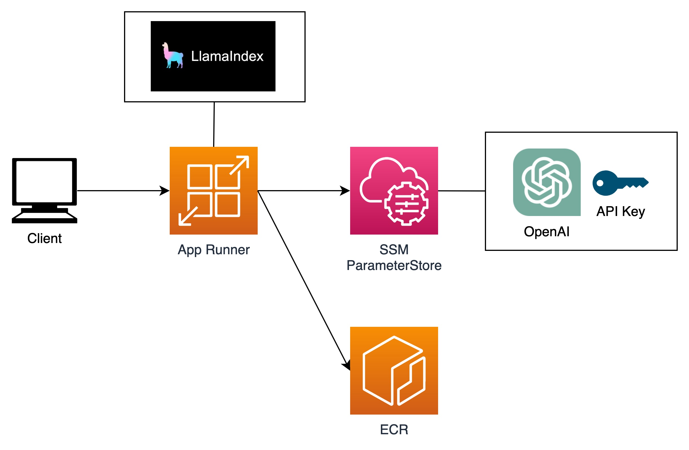

# LlamaIndex on App Runner with AWS CDK

This project is a sample project that runs LlamaIndex on App Runner using AWS CDK.



More Japanese Information [LlamaIndex を App Runner 上で動かしてみた](https://dev.classmethod.jp/etc/llamaindex-on-app-runner/)

## Getting Started

### Put OpenAI API key

Put your OpenAI API key in SSM Parameter Store.

```
% aws ssm put-parameter --name "/OpenAiApiKey" --value "your key here" --type SecureString
```

### Container build

```
% cd src
% docker image build -t llamaindex-pack:latest .
```

Set the AWS credentials - access key, secret key, session token - and region to environment variables and run locally.

```
export AWS_REGION="your region"
export AWS_ACCESS_KEY_ID="your access key"
export AWS_SECRET_ACCESS_KEY="your secret key"
export AWS_SESSION_TOKEN="your session token"

docker run -it \
  -e AWS_DEFAULT_REGION=${AWS_REGION} \
  -e AWS_ACCESS_KEY_ID=${AWS_ACCESS_KEY_ID} \
  -e AWS_SECRET_ACCESS_KEY=${AWS_SECRET_ACCESS_KEY} \
  -e AWS_SESSION_TOKEN=${AWS_SESSION_TOKEN} \
  -p 8000:5601 llamaindex-pack:latest
```

After starting, check the operation with the following commands.

```
% curl "http://127.0.0.1:8000/query?text=Pleasetellmeyourname"
'My name is Paul Graham.'%
```

### CDK deploy

First, Deploy ECR.

```
# Check if cfn template generation is possible
% npx cdk synth "ContainerStack"

% npx cdk deploy "ContainerStack"
```

Next, push the built container to ECR.

```
% export AWS_ACCOUNT_ID="your aws account id"
% aws ecr get-login-password --region ${AWS_REGION} | \
  docker login --username AWS --password-stdin ${AWS_ACCOUNT_ID}.dkr.ecr.${AWS_REGION}.amazonaws.com
% docker tag llamaindex-pack:latest ${AWS_ACCOUNT_ID}.dkr.ecr.${AWS_REGION}.amazonaws.com/llama-index-repo:v1
% docker push ${AWS_ACCOUNT_ID}.dkr.ecr.${AWS_REGION}.amazonaws.com/llama-index-repo:v1
```

Last, deploy App Runner and Test.

```
% npx cdk deploy "LlamaindexRunnerStack"

% curl "https://xxxxxxxxxx.${AWS_REGION}.awsapprunner.com/query?text=Pleasetellmeyourname"

"My name is Paul Graham. I am the co-founder of the company Viaweb, which was funded by Julian, Idelle's husband. We gave him 10% of the company in return for the seed funding and legal and business advice. I had a negative net worth at the time, so the seed funding was essential for me to live on."%
```
